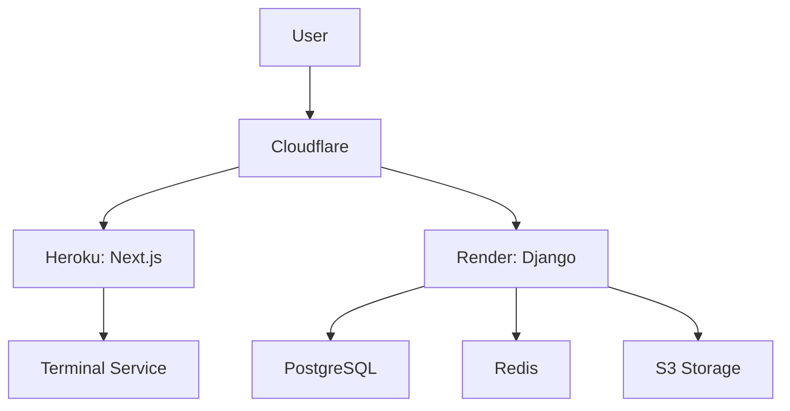

<h1 align="center">🚀 Amine Ouichou</h1>
<h3 align="center">Backend & DevOps Engineer | 42Paris Student</h3>

<p align="center">
  <a href="https://www.linkedin.com/in/amine-ouichou-168236345" target="_blank">
    
  </a>
  <a href="mailto:aouichou@gmail.com">
    
  </a>
  <a href="https://aouichou.me">
    
  </a>
</p>

<p align="center">
  
</p>

> "I have approximate knowledge of many things, from kernel syscalls to cloud scaling"

## 🛠️ Technical Showcase: Real-Time Project Terminal

[](https://aouichou.me/demo/miniRT)
[](https://github.com/aouichou/My-Portfolio/actions)

**Cloud-Native Terminal Service**  
*Django Channels · Redis · Docker · Render/Heroku*

### Key Features
- **Real Project Execution**
  - Secure in-browser access to Debian environment
  - Compile/run projects with `gcc`, `make`, etc.
  - Resource-limited containers (512MB RAM/1vCPU)
  
- **DevOps Architecture**

  ```mermaid
  graph TD
    User[User Browser] -->|HTTPS| CF[Cloudflare]
    CF -->|HTTP/2| Next[Next.js Frontend]
    CF -->|WebSocket| Django[Django Backend]
    Django -->|Internal WebSocket| WS[Terminal Service]
    Django -->|JSON| DB[(PostgreSQL)]
    Django -->|Async Tasks| Redis[(Redis Cache)]
    Django -->|Files| S3[(S3 Storage)]
    Next -->|API Calls| Django
    WS -->|PTY| Terminal[PTY Process]
    Terminal -->|Files| Project[Project Files]
    Github[GitHub] -->|CI/CD| Actions[GitHub Actions]
    Actions -->|Deploy| Next
    Actions -->|Deploy| Django
    Actions -->|Deploy| WS
  ```
  ```mermaid
  graph TD
    User[User Browser] -->|HTTPS| CF[Cloudflare]
    CF -->|HTTP/2| Next[Next.js Frontend]
    CF -->|WebSocket| Django[Django Backend]
    Django -->|Internal WebSocket| WS[Terminal Service]
    Django -->|JSON| DB[(PostgreSQL)]
    Django -->|Async Tasks| Redis[(Redis Cache)]
    Django -->|Files| S3[(S3 Storage)]
    Next -->|API Calls| Django
    WS -->|PTY| Terminal[PTY Process]
    Terminal -->|Files| Project[Project Files]
    Github[GitHub] -->|CI/CD| Actions[GitHub Actions]
    Actions -->|Deploy| Next
    Actions -->|Deploy| Django
    Actions -->|Deploy| WS
  ```
  
- **Security Measures**
  - Command allowlist/blocklist
  - Rate limiting (10 req/min)
  - Read-only filesystem mounts
  - Automatic session termination

## 🚀 Portfolio Infrastructure

[](https://render.com)
[](https://heroku.com)

**Tech Stack**
```text
Backend:   Python 3.11 · Django 4.2 · Django Channels · Redis
Frontend:  Next.js 14 · TypeScript · Tailwind CSS · Xterm.js
DevOps:    Docker · GitHub Actions · Render · Heroku · S3
Security:  Rate Limiting · CSP · Web Application Firewall
```

### Cloud Architecture


## 📊 System Performance

```text
Service              Uptime       Req/Min     Error Rate
══════════════════   ══════════   ═════════   ══════════
API Gateway          99.98%       1.2k        0.02%
Terminal Service     99.95%       850         0.15%
Database             100%         N/A         0%
```

## 🎓 42Paris Project Showcase

| Project | Description | Tech Stack | Score | Demo |
|---------|-------------|------------|-------|------|
| **[miniRT](https://github.com/aouichou/miniRT)** | Raytracing engine that renders 3D scenes with lighting effects | C, MiniLibX, Vector Math | 125% | [Try it](https://aouichou.me/demo/miniRT) |
| **[minishell](https://github.com/aouichou/minishell)** | Custom shell implementation with pipes, redirections, and signals | C, Readline, Linux Syscalls | 101% | [Try it](https://aouichou.me/demo/minishell) |
| **ft_transcendence** | Real-time Pong-like web app with tournaments and AI opponents | Django, WebSockets, JWT | 125% | Coming soon |

### [miniRT Interactive Demo](https://aouichou.me/demo/miniRT)

```bash
# In-browser terminal example
$ make && ./miniRT scenes/sphere.rt
✅ Built project in 2.1s
🖌️ Rendering 1920x1080 image...
```

## 🧠 Currently Working On

### 42Paris Kernel Projects
- **ft_linux**: Building a functional Linux distro from scratch.  
- **KFS_1**: Developing a custom kernel loader and minimal OS environment.
- **little-penguin-1**: Linux kernel programming challenges and driver development.

### Learning Focus
<table>
  <tr>
    <td>Kernel Programming</td>
    <td>[███████░░░] 70%</td>
  </tr>
  <tr>
    <td>Kubernetes</td>
    <td>[█████░░░░░] 50%</td>
  </tr>
  <tr>
    <td>Low-Latency Systems</td>
    <td>[███░░░░░░░] 30%</td>
  </tr>
</table>

## 📈 GitHub Statistics

<p align="center">
  
</p>

<p align="center">
  
  
</p>

<p align="center">
  <a href="https://aouichou.me">
    
  </a>
</p>
