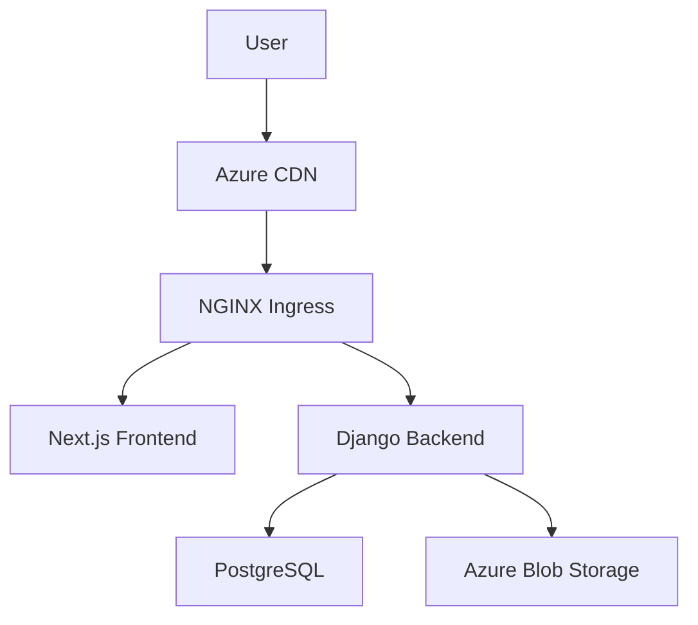

<h1 align="center">Hi 👋, I'm Amine</h1>
<h3 align="center">A bakend and DevOps developer and student at 42Paris</h3>

<p align="left">  </p>

<p align="left"> <a href="https://github.com/ryo-ma/github-profile-trophy"></a> </p>

- ⚡ Fun fact **I have approximate knowledge of many things**

<h3 align="left">Connect with me:</h3>
<p align="left">
<a href="https://www.linkedin.com/in/amine-ouichou-168236345" target="blank"></a>
</p>

<h3 align="left">Languages and Tools:</h3>
<p align="left"> <a href="https://www.gnu.org/software/bash/" target="_blank" rel="noreferrer">  </a> <a href="https://www.cprogramming.com/" target="_blank" rel="noreferrer">  </a> <a href="https://www.w3schools.com/cpp/" target="_blank" rel="noreferrer">  </a> <a href="https://www.djangoproject.com/" target="_blank" rel="noreferrer">  </a> <a href="https://www.docker.com/" target="_blank" rel="noreferrer">  </a> <a href="https://www.figma.com/" target="_blank" rel="noreferrer">  </a> <a href="https://git-scm.com/" target="_blank" rel="noreferrer">  </a> <a href="https://grafana.com" target="_blank" rel="noreferrer">  </a> <a href="https://developer.mozilla.org/en-US/docs/Web/JavaScript" target="_blank" rel="noreferrer">  </a> <a href="https://www.elastic.co/kibana" target="_blank" rel="noreferrer">  </a> <a href="https://www.linux.org/" target="_blank" rel="noreferrer">  </a> <a href="https://mariadb.org/" target="_blank" rel="noreferrer">  </a> <a href="https://www.nginx.com" target="_blank" rel="noreferrer">  </a> <a href="https://nodejs.org" target="_blank" rel="noreferrer">  </a> <a href="https://www.postgresql.org" target="_blank" rel="noreferrer">  </a> <a href="https://postman.com" target="_blank" rel="noreferrer">  </a> <a href="https://www.python.org" target="_blank" rel="noreferrer">  </a> <a href="https://reactjs.org/" target="_blank" rel="noreferrer">  </a> <a href="https://www.sqlite.org/" target="_blank" rel="noreferrer">  </a> <a href="https://www.typescriptlang.org/" target="_blank" rel="noreferrer">  </a> </p>

## 🌟 Featured Portfolio Project (WIP)

[](https://aouichou.me)
[](https://github.com/aouichou/My-Portfolio)

**Cloud-Native Full-Stack Architecture**  
*Django 4.2 | Next.js 14 | Kubernetes | Azure DevOps*

### 🚀 Key Features
- **Production-Grade Deployment**
  - Multi-stage Docker builds with Alpine optimization
  - Kubernetes cluster on Azure AKS
  - Automated CI/CD with GitHub Actions
  - TLS certificates via cert-manager

- **Observability Stack**
  - Prometheus/Grafana monitoring
  - ELK Stack logging
  - Application performance tracing

- **Security Posture**
  - Rate-limited API endpoints
  - CSP headers enforcement
  - HashiCorp Vault integration (WIP)

```bash
# Local development setup
docker-compose up -d frontend backend reverse-proxy

# Production deployment
kubectl apply -f kubernetes/ --recursive
```

### 📊 Infrastructure Overview


[Explore the Code →](https://github.com/aouichou/My-Portfolio) | [Live Demo](https://aouichou.me)

---


## Notable 42Paris Projects

### [miniRT](https://github.com/aouichou/miniRT)
- Generate images using Raytracing with the **MiniLibX**.  
- Scene specification uses the “.rt” format.  
- Fully supported plane, sphere, and cylinder, plus bonus features like reflections and color patterns.  
- Achieved a final mark of **125%**.

### [minishell](https://github.com/aouichou/minishell)
- Custom shell in C supporting redirections, pipes, and custom signals.  
- Used `readline`, `fork`, and many other Linux system calls.  
- Achieved a final mark of **101%**.

### ft_transcendence
- Real-time Pong-like web app, with user tournaments, AI opponents, and advanced security.  
- Achieved a final mark of **125%**.  
- **Modules I developed independently**:  
  - Framework-based backend  (Django)
  - Standard user management and authentication  
  - Remote authentication  
  - GDPR compliance (user anonymization, data management, account deletion)  
  - Two-Factor Authentication (2FA) with JWT  
  - Microservices-based backend

## Currently working on the following 42Paris Kernel Projects
- **ft_linux**: Building a functional Linux distro from scratch.  
- **KFS_1**: Developing a custom kernel loader, linking process, and minimal OS environment.  
- **little-penguin-1**: Linux kernel programming challenges, drivers, and subsystem maintenance.

## Currently Learning

   - ### [Kernel programming](https://en.wikipedia.org/wiki/Kernel_%28operating_system%29)

   - ### [Kubernetes](https://en.wikipedia.org/wiki/Kubernetes)

   - ### low-latency programming


<p></p>

<p>&nbsp;</p>

<p></p>

